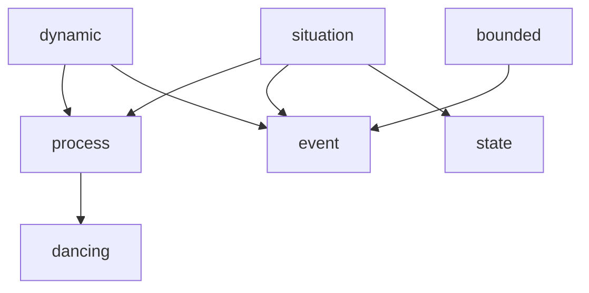
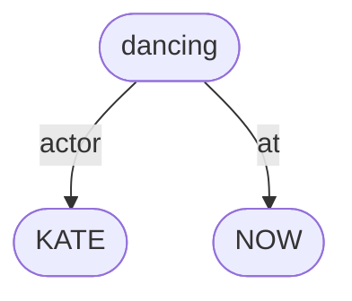
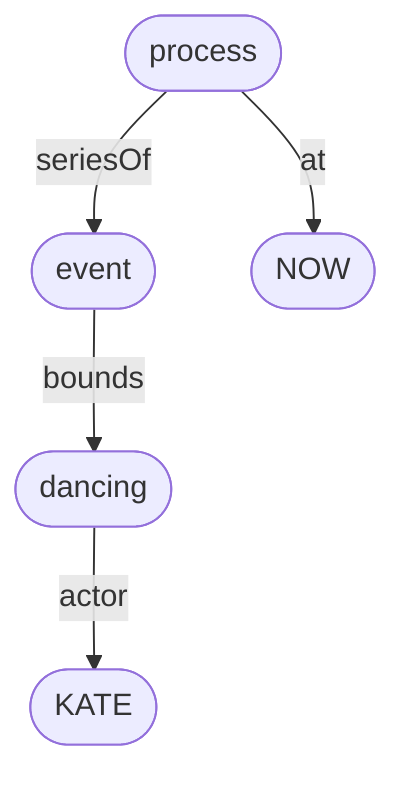
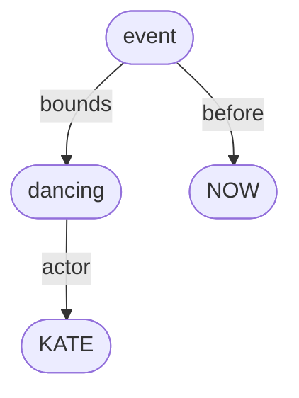
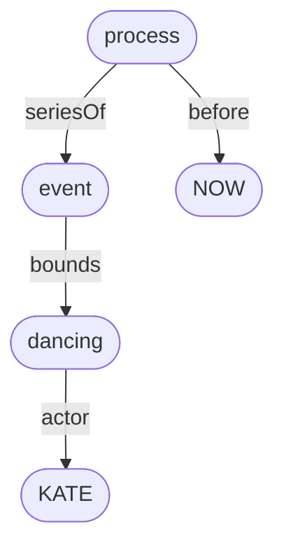
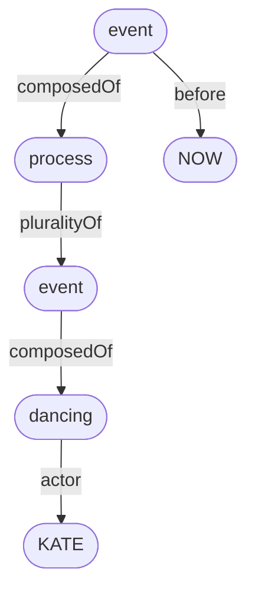

# Bernard Comrie (1985) *Tense*

Every finite verb form in English has morphosyntactic tense – either <mark>present</mark> tense or <mark>past</mark> tense. 

Here are some present tense finite verb forms:
- *Kate **dances**.*
- *Kate **is** dancing.*
- *Kate **will** dance.*
- *Kate **will** be dancing.*
- *Kate **has** danced.*
- *Kate **has** been dancing.*
- *Kate **will** have been dancing.*

Here are the corresponding past tense finite verb forms:
- *Kate **danced**.*
- *Kate **was** dancing.*
- *Kate **would** dance.*
- *Kate **would** be dancing.*
- *Kate **had** danced.*
- *Kate **had** been dancing.*
- *Kate **would** have been dancing.*

For Comrie:
- When a finite verb is in the present tense, this just means that the situation (event, process or state) described by the verb (and its dependents) **IS true** at the moment of utterance.
- When a finite verb is in the past tense, this just means that the situation described by the verb (and its dependents) **WAS true** at some moment that precedes the moment of utterance.

## Simple tenses

Let’s start with the so-called ‘simple tense’ examples:
- *Kate **dances**.*
- *Kate **danced**.*

The lexical verb here is *dance*, which intrinsically describes a **process** (rather than an event or state). Simply put:
- Processes and events are *dynamic*, whereas states are not.
- Events are *bounded*, whereas processes and states are not. 

So, a process like *dancing* is a dynamic, non-bounded situation.

We can formalise these definitions as follows:

```
∀x. dancing(x) → process(x)
∀x. process(x) ↔ situation(x) ∧ dynamic(x) ∧ ¬bounded(x)
∀x. event(x) ↔ situation(x) ∧ dynamic(x) ∧ bounded(x)
∀x. state(x) ↔ situation(x) ∧ ¬dynamic(x) ∧ ¬bounded(x)
```

Or as an inheritance hierarchy:



### Simple present – *Kate dances*

In the simple present example *Kate dances*, the present tense suffix *-(e)s* has been appended to the process verb *dance*.

Given Comrie’s characterisation of present tense meaning above, it might be expected that the meaning of *Kate dances* would be something like this:

```
∃x. dancing(x) ∧ actor(x,KATE) ∧ at(x,NOW)
```

As a graph:



In other words, there is a process involving Kate doing some dancing, which is true right now, at the moment the sentence is being uttered by the speaker.

However, for some reason, and unlike in most other languages we might be familiar with, the simple present tense in English doesn’t work like that with process and event (ie. dynamic) verbs.

Rather, the most common meaning of *Kate dances* is to describe a current **habit**, rather than simply a current process:

```
∃xyz. at(x,NOW) ∧ series-of(x,y) ∧ bounds(y,z) ∧ dancing(z) ∧ actor(z,KATE) 
```

As a graph:



A habit is understood to be a complex process consisting of a plurality (or iteration, or aggregate, or series) of events, each of which is a bounded process – in this case a series of bounded dancing events. 

Here are some relevant definitions:

```
∀xy. bounds(x,y) → event(x) ∧ process(y)
∀xy. series-of(x,y) → process(x) ∧ event(y)
```

In sum, to say that *Kate dances* is to say that Kate currently engages in regular episodes of dancing, but admittedly is probably not engaged in one of these right now at the moment of utterance.

### Simple past – *Kate danced*

In the simple past example *Kate danced*, the past tense suffix *-(e)d* has been appended to the process verb *dance*.

In accordance with Comrie’s characterisation of past tense meaning above, the most common meaning of *Kate danced* is probably this:

```
∃xy. before(x,NOW) ∧ bounds(x,y) ∧ dancing(y) ∧ actor(y,KATE)
```

As a graph:



This is the sense that *Kate danced* has in the following kind of contexts: 

> Kate drank a glass of cider. She danced. She went to the restroom. She danced again. She went home and watched TV.
>
> Kate danced, for 25 minutes.

In this sense, Kate danced described a bounded event, composed of a process.

But there is also another meaning, related to the habitual meaning of the simple present discussed above:

```
∃xyz. before(x,NOW) ∧ series-of(x,y) ∧ bounds(y,z) ∧ dancing(z) ∧ actor(z,KATE) 
```

Graph:



In context:

> I lived with two girls, Kate and Lucy. Lucy sang and played piano. Kate danced.
>
> Kate danced, every Wednesday evening.

past historic versus imperfect in Romance languages?


Third meaning?

```
∃xyzw. before(x,NOW) ∧ composed-of(x,y) ∧ plurality-of(y,z) ∧ composed-of(z,w) ∧ dancing(w) ∧ actor(w,KATE) 
```

Graph:



Context:

> Kate danced, every Wednesday evening until she turned 35.


Russian aspect?


----


