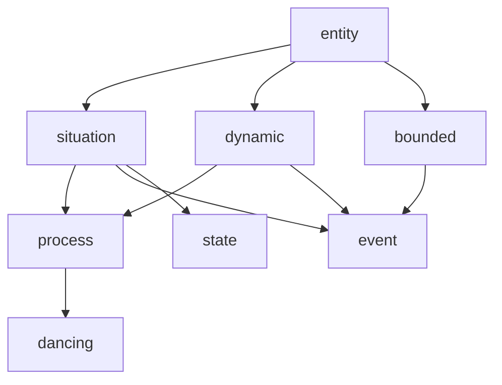
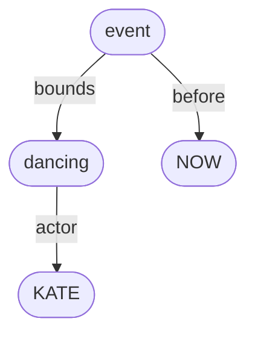
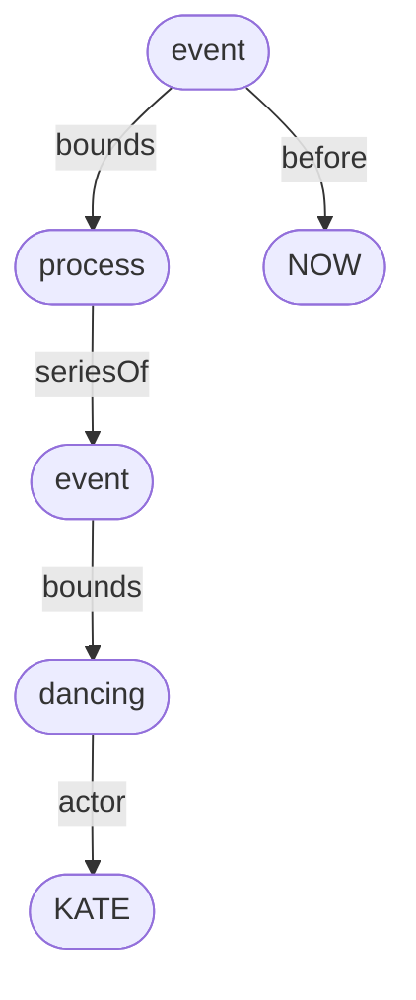

# Bernard Comrie (1985) *Tense*

Every finite verb form in English has grammatical tense – either <mark>present</mark> tense or <mark>past</mark> tense. 

Here are some present tense forms:
- *Kate **dances**.*
- *Kate **is** dancing.*
- *Kate **will** dance.*
- *Kate **will** be dancing.*
- *Kate **has** danced.*
- *Kate **has** been dancing.*
- *Kate **will** have been dancing.*

And here are the corresponding past tense forms:
- *Kate **danced**.*
- *Kate **was** dancing.*
- *Kate **would** dance.*
- *Kate **would** be dancing.*
- *Kate **had** danced.*
- *Kate **had** been dancing.*
- *Kate **would** have been dancing.*

Comrie’s theory of the semantics of grammatical tense can be summarised as follows:
- A present tense finite verb refers to a situation (event, process or state) which is true at the moment of utterance.
- A past tense finite verb refers to a situation which **was** true at some moment **before** the moment of utterance.

Let’s look at how this works out for the two English tenses:
- [simple tenses](#simple-tenses)
  - [simple present – *Kate dances*](#simple-present--kate-dances)
  - [simple past – *Kate danced*](#simple-past--kate-danced)
- [progressive construction](#progressive-construction)
  - [present progressive – *Kate is dancing*](#present-progressive--kate-is-dancing)
  - [past progressive – *Kate was dancing*](#past-progressive--kate-was-dancing)

## Simple tenses

Let’s start with the two so-called ‘simple tense’ examples:
- *Kate **dances**.*
- *Kate **danced**.*

The lexical verb here is *dance*, which intrinsically describes a **process** (or activity), rather than an event or state). Simply put:
- Processes and events are *dynamic*, whereas states are not.
- Events are *bounded*, whereas processes and states are not. 

So, a process like *dancing* is a dynamic, non-bounded situation.

We can formalise these definitions as follows:

```
∀x. dancing(x) → process(x)
∀x. process(x) ↔ situation(x) ∧ dynamic(x) ∧ ¬bounded(x)
∀x. event(x) ↔ situation(x) ∧ dynamic(x) ∧ bounded(x)
∀x. state(x) ↔ situation(x) ∧ ¬dynamic(x) ∧ ¬bounded(x)
```

Or as an inheritance hierarchy:



Back up to: [Top](#)

### Simple present – *Kate dances*

In the simple present example *Kate dances*, the present tense suffix *-(e)s* has been appended to the process verb *dance*.

Given Comrie’s characterisation of present tense meaning above, it might be expected that the meaning of *Kate dances* would be something like this:

```
∃x. dancing(x) ∧ actor(x,KATE) ∧ at(x,NOW)
```

As a graph:


In other words, there is a process involving Kate doing some dancing, which is true right now, at the moment the sentence is being uttered by the speaker.

However, for some reason, and unlike in most other languages we might be familiar with, the simple present tense in English doesn’t work like that with process and event (ie. dynamic) verbs.

Rather, the most common meaning of *Kate dances* is to describe a current **habit**, rather than simply a current process:

```
∃xyz. at(x,NOW) ∧ series-of(x,y) ∧ bounds(y,z) ∧ dancing(z) ∧ actor(z,KATE) 
```

Again, as a graph:


A habit is understood to be a complex process consisting of a series (or iteration, or aggregate, or plurality) of events, each of which is a bounded process – in this case a series of bounded dancing events. 

Here are some relevant definitions:

```
∀xy. bounds(x,y) → event(x) ∧ process(y)
∀xy. series-of(x,y) → process(x) ∧ event(y)
```

In sum, to say that *Kate dances* is usually to say that Kate currently engages in regular episodes of dancing, but is probably not engaged in one of these right now at the moment of utterance.

Back up to: [Top](#)

### Simple past – *Kate danced*

In the simple past example *Kate danced*, the past tense suffix *-(e)d* has been appended to the process verb *dance*.

In accordance with Comrie’s characterisation of past tense meaning above, the most common meaning of *Kate danced* is probably this:

```
∃xy. before(x,NOW) ∧ bounds(x,y) ∧ dancing(y) ∧ actor(y,KATE)
```

Or, in graph form:



This is the sense that *Kate danced* has in the following kind of contexts: 

> Kate drank a glass of cider. She danced. She went to the restroom. She danced again. She went home and watched TV.
>
> Kate danced, for 25 minutes.

In this sense, *Kate danced* describes a bounded event, composed of a process, with a definite beginning and end.

However, there is also another meaning, related to the habitual meaning of the simple present discussed above:

```
∃xyz. before(x,NOW) ∧ series-of(x,y) ∧ bounds(y,z) ∧ dancing(z) ∧ actor(z,KATE) 
```

This meaning is encoded in the following graph:


In this sense, *Kate danced* refers to a prior habit – a series of bounded dancing events that was true at some moment in the past, but may not be true at the moment of utterance (ie. she may have given up dancing).

This sense is relevant in the following kinds of context:

> I lived with two girls, Kate and Lucy. Lucy sang and played piano. Kate danced.
>
> Kate danced, every Wednesday evening.

Romance languages like French, Italian or Spanish tend to have different past tense verb forms for these two different senses:
- The past historic form *Kate dansa* is used to refer to a bounded event in the past (at least in written French).
- The imperfect form *Kate dansait* is used to refer to a past habitual process.

There may also be a third sense of *Kate danced*:

```
∃xyzw. before(x,NOW) ∧ bounds(x,y) ∧ series-of(y,z) ∧ bounds(z,w) ∧ dancing(w) ∧ actor(w,KATE) 
```

Or as a graph:



In this sense, *Kate danced* refers to a bounded habit in the past, as in the following kind of context:

> Kate danced, every Wednesday evening until she turned 35. 

Something akin to this sense is encoded in the distributive perfective aspect in Slavic languages.

Back up to: [Top](#)

## Progressive construction

Let’s now look at the two simple tense ‘progressive’ examples:
- *Kate **is dancing**.*
- *Kate **was dancing**.*

The progressive constructing involves a form of the auxiliary verb *be* taking as its complement the present participle of a lexical verb – in this case *dancing* is the present participle of the process verb *dance*, and *be dancing* is a progressive construction.

Semantics of the progressive? For a process verb?

```
∃x. dancing(x) ∧ actor(x,KATE)
```


Back up to: [Top](#)

### Present progressive – *Kate is dancing*

```
∃x. dancing(x) ∧ actor(x,KATE) ∧ at(x,NOW)
```

Back up to: [Top](#)

### Past progressive – *Kate was dancing*

```
∃x. dancing(x) ∧ actor(x,KATE) ∧ before(x,NOW)
```

Imperfect tense?

Back up to: [Top](#)


----


