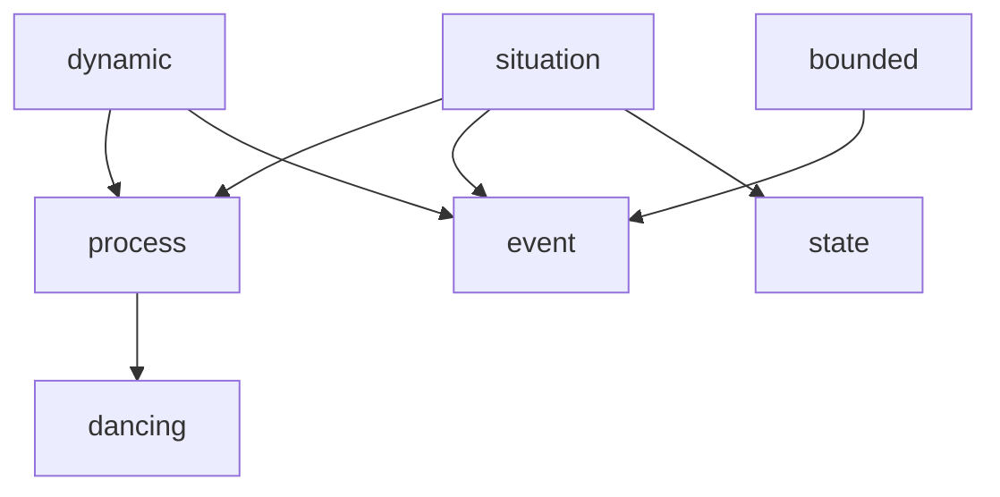
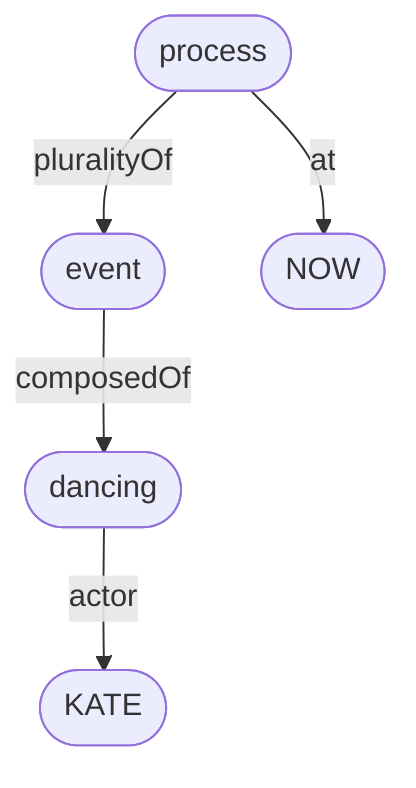

# Bernard Comrie (1985) *Tense*

Every finite verb form in English has morphosyntactic tense – either <mark>present</mark> tense or <mark>past</mark> tense. 

Here are some present tense finite verb forms:
- *Kate **dances**.*
- *Kate **is** dancing.*
- *Kate **will** dance.*
- *Kate **will** be dancing.*
- *Kate **has** danced.*
- *Kate **has** been dancing.*
- *Kate **will** have been dancing.*

Here are the corresponding past tense finite verb forms:
- *Kate **danced**.*
- *Kate **was** dancing.*
- *Kate **would** dance.*
- *Kate **would** be dancing.*
- *Kate **had** danced.*
- *Kate **had** been dancing.*
- *Kate **would** have been dancing.*

For Comrie:
- When a finite verb is in the present tense, this just means that the situation (event, process or state) described by the verb (and its dependents) **IS true** at the moment of utterance.
- When a finite verb is in the past tense, this just means that the situation described by the verb (and its dependents) **WAS true** at some moment that precedes the moment of utterance.

## Simple tenses

Let’s start with the so-called ‘simple tense’ examples:
- *Kate **dances**.*
- *Kate **danced**.*

The lexical verb here is *dance*, which intrinsically describes a **process** (rather than an event or state). Simply put:
- Processes and events are *dynamic*, whereas states are not.
- Events are *bounded*, whereas processes and states are not. 

So, a process like dancing is a dynamic, non-bounded situation.

We can formalise these definitions as follows:

```
∀x. dancing(x) → process(x)
∀x. process(x) ↔ situation(x) ∧ dynamic(x) ∧ ¬bounded(x)
∀x. event(x) ↔ situation(x) ∧ dynamic(x) ∧ bounded(x)
∀x. state(x) ↔ situation(x) ∧ ¬dynamic(x) ∧ ¬bounded(x)
```

Or as an inheritance hierarchy:



### Simple present – *Kate dances*

In the simple present example *Kate dances*, the present tense suffix *-s* has been appended to the process verb *dance*.

Given Comrie’s characterisation of present tense meaning above, it might be expected that the meaning of *Kate dances* would be something like this:

```
∃x. dancing(x) ∧ actor(x,KATE) ∧ at(x,NOW)
```

As a graph:


In other words, there is a process involving Kate doing some dancing, which is true right now, at the moment the sentence is being uttered by the speaker.

However, for some reason, and unlike in most other languages we might be familiar with, the simple present tense in English doesn’t work like that with process and event (ie. dynamic) verbs.

Rather, the unmarked meaning of *Kate dances* is the description of a current **habit**, rather than simply a current process:

```
∃xyz. at(x,NOW) ∧ plurality-of(x,y) ∧ composed-of(y,z) ∧ dancing(z) ∧ actor(z,KATE) 
```

As a graph:



\[HERE\]

This can be understood in terms of the following definitions:

```
∀xy. composed-of(x,y) → event(x) ∧ process(y)
∀xy. plurality-of(x,y) → process(x) ∧ event(y)
```


In other words, a (non-bounded) process like dancing can be *composed* into a (bounded) event describing a single episode of dancing with an inception and a termination.

Similarly, a (bounded) event can be *pluralised* into a (non-bounded) activity describing a special kind of process known as a ‘habit’.

To say that *Kate dances* is to say that Kate currently engages in regular episodes of dancing, but might not be engaged in one of these right now at the moment of utterance.

### Simple past – *Kate danced*


```
∃x. event(x) ∧ before(x,now) ∧ comp(x,y) ∧ dancing(y) ∧ sbj(y,Kate) 
∃xyz. habit(x) ∧ before(x,now) ∧ plural(x,y) ∧ comp(y,z) ∧ dancing(z) ∧ sbj(z,Kate) 
```

Kate and Lucy went out to a club. Lucy drank. Kate danced. They left the club. They took the subway home.

I lived with two girls, Kate and Lucy. Lucy sang and played piano. Kate danced. 


graph? FOL

Most other European languages, this would mean the single process that holds right now, but not in English!

A process verb in the present simple forces habitual meaning for some reason.


Here the present tense suffix *-s* is attached to the verb *sing*, which is a **process verb**. This means that, intrinsically, the situation described by *sing* is a **process** – it consists of a non-bounded series of actions on the part of the swimmer, viewed from a time perspective that lies within the process itself.

perfective / imperfective

might also be true at other moments as well!


different for event verbs, process verbs and state verbs? swim is an activity/process verb, non-bounded non-culminating, doesn't change the world.


